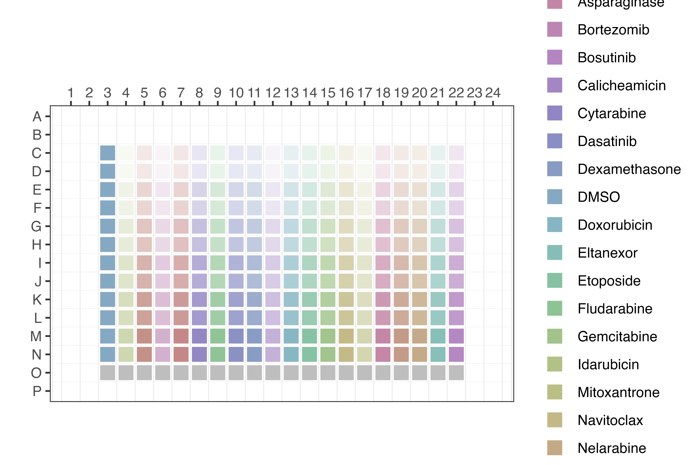
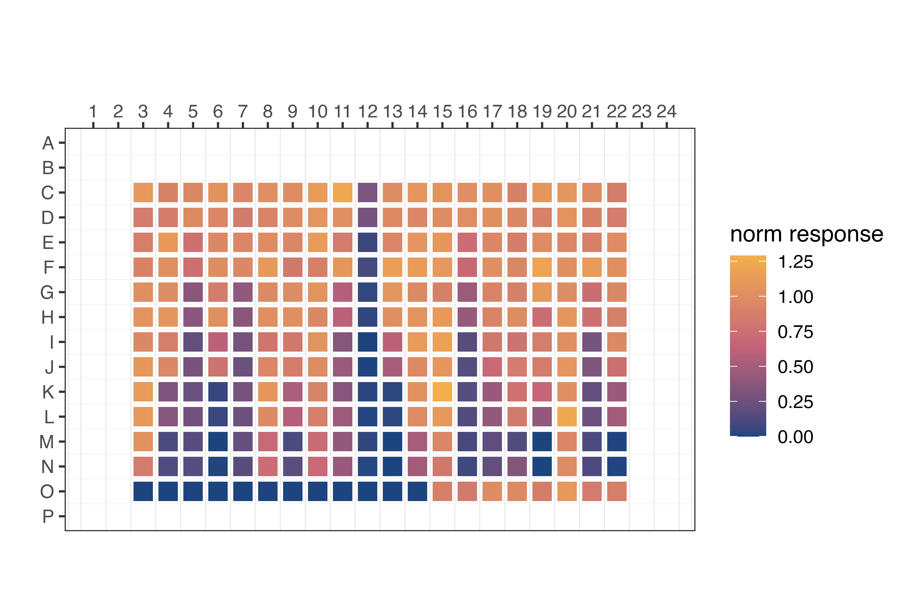

# Loading data via REST-API

## Setup

We will load DRP data into a Postgres database via a standardized REST
interface. For thsis purpose start a local REST-API server in the
background (the server can be shut down later with `app$kill()`)

``` r
# start up the REST-API server to communicate with the database
app <- drpr::runAPI(background = TRUE)

# Base URI to serve requests
base_uri <- "http://127.0.0.1:3840/v1"

# Define the project root
here::i_am("inst/analysis.Rmd")
```

> *Note*: The REST-API is interactively documented via a Swagger
> interface available at `http://127.0.0.1:3840/__docs__/`

## Loading data into the database

### Clinical data

Instantiate a new test patient, disease stage, sample and assay by
making a HTTP `POST` request to the database

``` r
crf <- list(
  patient = list(
    pid = 1,
    patient_crossref = "ZH-01",
    birth_year = 2020,
    diagnosis_id = 2,
    sex_id = 1,
    diagnosis_id = 2,
    treating_hospital_id = 1
  ),
  stage = list(
    stage_id = 1,
    pid = 1,
    disease_stage_id = 0,
    stage_date = "2025-01-01",
    tissue_id = 2
  ),
  sample = list(
    sid = 1,
    stage_id = 1,
    pid = 1,
    sample_crossref = "ZH-01-A",
    puncture_date = "2025-01-01",
    timepoint_collection = "d0",
    tissue_id = 1
  ),
  assay = list(
    assay_id = 1,
    assay_description = "test_assay",
    sid = 1,
    drp_date = "2025-01-05",
    leukemia_seeded = 10000,
    fresh = FALSE,
    msc_detached_id = 0,
    contamination = 0
  )
)

# push the data into the database
drpr::request(
  uri = "{base_uri}/patient",
  method = "post",
  body = crf[["patient"]]
)

drpr::request(
  uri = "{base_uri}/stage",
  method = "post",
  body = crf[["stage"]]
)

drpr::request(
  uri = "{base_uri}/sample",
  method = "post",
  body = crf[["sample"]]
)

drpr::request(
  uri = "{base_uri}/assay",
  method = "post",
  body = crf[["assay"]]
)

# check that the patient was indeed created
drpr::request(
  uri = "{base_uri}/patient/1",
  method = "get"
)
```

### DRP data

Next, load the drug layout into the database

``` r
layout_body <- list(
  layout_id = 1,
  file = here::here(
    "inst/data/layout.csv"
  ),
  type_id = 2,
  format_id = 2
)

drpr::request(
  uri = "{base_uri}/layout",
  method = "post",
  body = layout_body
)
```



Load the measurement into the database

``` r
measurement_body <- list(
  measurement_id = 1,
  file = here::here(
    "inst/data/measurement.csv"
  ),
  plate_no = 1,
  format_id = 2,
  img_well_coverage = 0.66
)

drpr::request(
  uri = "{base_uri}/measurement",
  method = "post",
  body = measurement_body
)
```



Assign the layout, measurement and assay to a plate

``` r
body <- tibble::tibble(
  plate_id = 1,
  layout_id = 1,
  measurement_id = 1,
  assay_id = 1
)

drpr::request(
  uri = "{base_uri}/plate",
  method = "post",
  body = body
)
```

Normalize the drug responses to DMSO

``` r
drpr::request(
  uri = "{base_uri}/normalize_measurement/1",
  method = "put"
)
```

➡️ Next, continue with [**Part II: Curve fitting and drug
scoring**](analysis.md)
