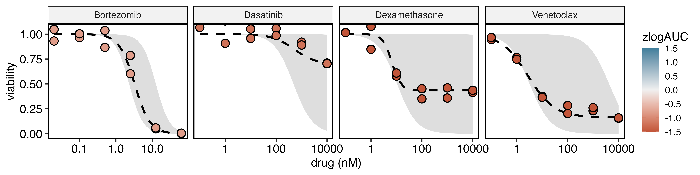

```{r, include = FALSE}
knitr::opts_chunk$set(
  collapse = TRUE,
  comment = "#>"
)
```

## Setup

In this part we will fit a dose-response model to DRP data stored in a local Postgres database and compute drug response metrics.
Finally, we will visualize dose-response fingerprints and drug distributions.

```{r, eval = FALSE}
# Define the project root
here::i_am("inst/analysis.Rmd")

# open a connection to the Postgres database
con <- drpr::connect_with_config("default")
```

## Curve fitting and drug scoring

Fit dose responses with a 3-parameter log-logistic model using the [drc](https://cran.r-project.org/web/packages/drc/index.html) package.

```{r, eval = FALSE}
pool::dbReadTable(con, "plate_content_view") |>
  drpr::cli_fit(con)
```

Write cohort statistics (mean, standard deviation, median, IQR) from a primary DRP cohort into the database. 

```{r, eval = FALSE}
cohort_stats <- readr::read_csv(here::here("inst/data/cohort_stats.csv"))
pool::dbWriteTable(con, "cohort_stats", cohort_stats, append = TRUE)
```


From the fitted dose response parameter compute derivative metrics such as absolute logEC50 and the logAUC. 
Use the cohort statistics to compute z-scores for the logAUC metric.


```{r, eval = FALSE}
pool::dbReadTable(con, "feature_view") |>
  drpr::derive_fit_features(con) |>
  drpr::calculate_zscore_from_stats(con, cohort_id = 1, logAUC) |>
  dplyr::select(drug_name, logEC50, norm_logAUC, abs_logEC50, zlogAUC) |>
  dplyr::mutate(dplyr::across(is.numeric, ~ round(.x, 2))) |>
  drpr::as_flextable(
    save = TRUE,
    filename = here::here("man/figures/plots/feature_table.png")
  )
```


## Visualizing data

Visualize the dose-response profiles and drug distributions

```{r, eval = FALSE}
drpr::plot_profile(
  con,
  drug_name %in% c("Venetoclax", "Bortezomib", "Dexamethasone", "Dasatinib"),
  .fg_sample_mask = sid == 1,
  color_fill = zlogAUC,
  limits = c(-1.5, 1.5),
  quantiles = TRUE,
  save = TRUE,
  filename = here::here("man/figures/plots/profiles.png"),
  nrow = 1,
  width = 10
)
```



```{r, eval = FALSE}
drpr::plot_distribution(
  con,
  .point_mask = sid == 1,
  .jitter_mask = cohort_id == 1,
  color_fill = zlogAUC,
  sort_by = norm_logAUC,
  quantiles = TRUE,
  add_boxplot = TRUE,
  limits = c(-1.5, 1.5),
  save = TRUE,
  filename = here::here("man/figures/plots/distribution.png")
)
```


